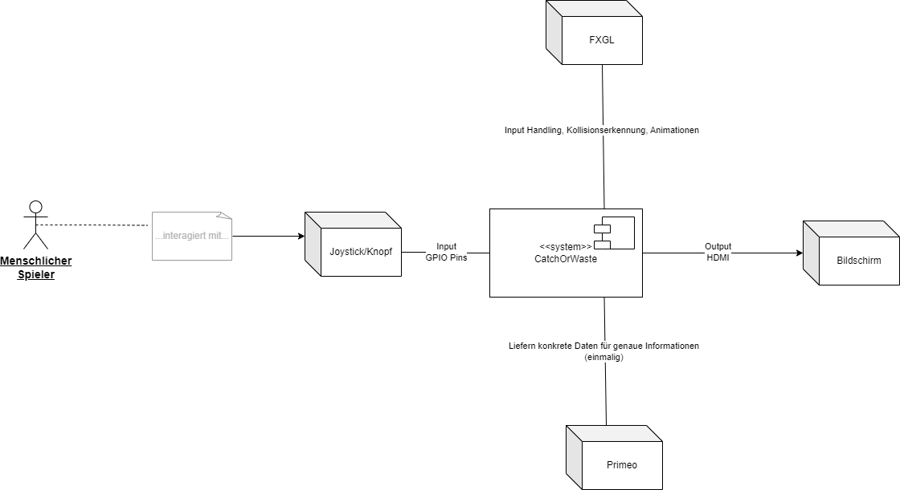

[[section-system-scope-and-context]]
== Kontextabgrenzung

[role="arc42help"]
****

Eine Kontextabgrenzung ist ein essentielles Instrument im Systemdesign,
das die Interaktionen zwischen dem System und seiner Umgebung definiert.
Es identifiziert alle externen Entitäten, mit denen das System kommuniziert,
seien es Benutzerrollen oder Nachbarsysteme, und legt die externen Schnittstellen fest.
Ziel ist es, einen klaren Rahmen zu schaffen, der die Verantwortlichkeiten des Systems
und die seiner angrenzenden Systeme aufzeigt. Dies umfasst die Abgrenzung von fachlichen
Funktionen, die das System durchführt, einschließlich der notwendigen Ein- und Ausgaben,
und dem technischen Kontext, der die spezifischen Kanäle, Protokolle und Hardware-Aspekte
umfasst, die für die Realisierung dieser Funktionen erforderlich sind.

****

=== Fachlicher Kontext

[role="arc42help"]
****
[options="header"]
|===
|Fachlicher Kontext | Fachlicher Kontext
|Nutzerinteraktion| Nutzer interagiert mittels Joystick und Knopf. Diese Inputs dienen dazu, das Spielgeschehen zu steuern und zu beinflussen.
|Spielreaktion| Das Spiel nimmt Inputs auf und wandelt diese in visuelle Outputs um.
****
=== Technischer Kontext

[role="arc42help"]
****
[options="header"]
|===
|Technischer Kontext | Technische Schnittstelle | Technische Realisierung
| Joystick und Knopf | GPIO-Pins(Output) | Die physischen Aktionen des Spielers werden in elektrische Signale umgewandelt, die von den GPIO-Pins gelesen werden.
|Raspberry Pi | Micro-HDMI, GPIO-Pins(Input) | Der Raspberry Pi verarbeitet die Eingabesignale des Joysticks und des Knopfes mit Hilfe der JavaFXGL-Bibliotheken, um das Spielgeschehen entsprechend zu steuern.
|Bildschirm|HDMI| Grafische Ausgaben des Spiels werden über den HDMI-Port an den Bildschirm gesendet.
****