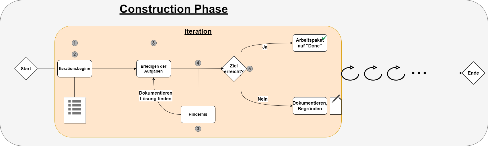

[[section-solution-strategy]]
== Lösungsstrategie

[role="arc42help"]
****
****
[cols="1,2",options="header"]
|===
|Technologie|Begründung
|Java 17| Ist eine https://gitlab.fhnw.ch/ip12-23vt/ip12-23vt_wegwerfgesellschaft/docu/-/blob/main/software(sad)/arc42-template.adoc?ref_type=heads#user-content-technische-randbedingungen[Technische Randbedingung], daher ist dies schon gegeben.
|FXGL| Anhand einer Analyse der verschiedenen Spieletechnologien ist folgendes Ergebnis herausgekommen:
FXGL entspricht den Anforderungen und den geplanten Features gemäss mehr als genügend. Für das Endprodukt reicht die Unterstützung aus und besitzt im Vergleich zu anderen Technologien einen geringeren Einstiegsaufwand. Siehe Analyse.
|===
****
****
=== Analyse
FXGL, LibGDX und JMonkeyEngine stehen als Auswahl zum Vergleich:
|===
| Kriterium | FXGL | LibGDX | JMonkeyEngine

| Anforderungsanalyse | Gut für 2D, weniger für 3D | Vielseitig, unterstützt 2D und 3D | Hauptsächlich für 3D

| Funktionalität und Features | Fokussiert auf 2D, eingebaute Physik | Umfassend für 2D und 3D | Leistungsstarke 3D-Engine, Shader-Unterstützung

| Performance | Gut für 2D, moderat für einfache 3D | Gute Performance in 2D und 3D | Hervorragende 3D-Performance

| Community und Unterstützung | Wächst, kleinere Community | Große und aktive Community | Aktive Community mit solidem Support

| Stabilität und Zuverlässigkeit | Stabil, weniger etabliert | Stabil und zuverlässig, gut dokumentiert | Zuverlässig, bewährt in 3D-Spieleentwicklung

| Entwicklungs- und Wartungsaufwand | Geringer Einstiegsaufwand, begrenzte 3D-Unterstützung | Moderater Aufwand, umfassende Dokumentation | Etwas höherer Einstiegsaufwand, robuste Funktionen

| Integration mit bestehenden Systemen | Einfache Integration, weniger für komplexe Systeme | Gute Integration in verschiedene Umgebungen | Kann in komplexe Projekte integriert werden

| Lizenzierung und Kosten | Open Source, kostenfrei | Open Source, kostenfrei | Open Source, kostenfrei

| Plattformunterstützung | Plattformunabhängig (JavaFX) | Plattformunabhängig (Java) | Plattformunabhängig (Java)

| Aktualität und Zukunftssicherheit | Aktive Entwicklung, kleineres Ökosystem | Aktive Entwicklung, große Community | Aktive Entwicklung, etabliert in 3D-Spieleentwicklung

| Referenzprojekte und Erfahrungen | Weniger Referenzprojekte, aufstrebende Technologie | Viele Referenzprojekte, gut dokumentierte Erfahrungen | Bekannte Referenzprojekte, etablierte Community

| Proof of Concept (PoC) | Schnelle Prototypenerstellung für einfache 2D-Spiele | Gute Unterstützung für Prototyping, skalierbar für komplexe Projekte | Eignet sich gut für 3D-Spieleprototypen
|===

=== Top-Level Zerlegung

Die Zerlegung erfolgt mit dem Schichtenmodell. Das Schichtenmodell ist ein altbekanntes Beispiel und wurde anhand von folgenden Punkten evaluiert und ausgewählt:

. Klare Trennung von Verantwortlichkeiten:

Das Drei-Schichten-Modell ermöglicht eine deutliche Abgrenzung zwischen Präsentation, Anwendungslogik und Datenzugriff. Diese Struktur verbessert die Lesbarkeit des Codes, erleichtert die Wartung und unterstützt klare Verantwortlichkeiten für jedes Architektursegment.

[start=2]
. Skalierbarkeit und Flexibilität:

Durch die modulare Struktur des Drei-Schichten-Modells können einzelne Schichten unabhängig voneinander skaliert werden. Dies bietet Flexibilität in Bezug auf die Ressourcenzuweisung und ermöglicht eine effiziente Skalierung, wenn verschiedene Teile der Anwendung unterschiedliche Lasten haben.

[start=3]
. Wiederverwendbarkeit von Komponenten:

Die klare Schichtentrennung fördert die Wiederverwendbarkeit von Komponenten. Dies ermöglicht es, bestimmte Module innerhalb derselben Schicht oder sogar zwischen verschiedenen Anwendungen zu nutzen, was zu einer effizienten Entwicklung und einem verbesserten Code-Management führt.

[start=4]
. Unabhängige Entwicklung:

Jede der drei Schichten kann unabhängig voneinander entwickelt werden. Dies ermöglicht eine parallele Entwicklung, beschleunigt den Gesamtentwicklungsprozess und unterstützt eine effektive Zusammenarbeit zwischen verschiedenen Teams oder Entwicklern.

[start=5]
. Klare Schnittstellen:

Das Drei-Schichten-Modell definiert klare Schnittstellen zwischen den Präsentations-, Anwendungslogik- und Datenzugriffsschichten. Diese klaren Schnittstellen erleichtern die Kommunikation und Interaktion zwischen den verschiedenen Teilen der Anwendung, was zu einer verbesserten Zusammenarbeit und Interoperabilität führt.

****
****
=== Erreichung der wichtigsten Qualitätsanforderungen

Anhand der ausgewählten Technologien und die Klarstellung der Top-Level Zerlegung kann die Erreichung der wichtigsten https://fhnw-projecttrack.atlassian.net/wiki/download/attachments/63900538/Qualit%C3%A4tsanforderungen_v3.0.xlsx?api=v2[Qualitätsanforderungen] sichergestellt werden. Damit die Anforderung sicher erfüllt ist, wird mit diversen Tests der Zustand überprüft.
Siehe https://fhnw-projecttrack.atlassian.net/wiki/spaces/IP1223vt6/pages/140476445/Testmanagement[Testmanagement]

=== Entwicklungsprozesse und Aufgabenbestimmung

Die verwendete Projektmethode RUP definiert als Entwicklungsphase die https://de.wikipedia.org/wiki/Rational_Unified_Process#Construction["Construction Phase"]. Bedeutend dafür sind das Erfüllen der Meilensteine, welche den Fortschritt des Projekts festhalten.

Um den Entwicklungsprozess zu bestimmen, sind folgende Meinungen entstanden:

- Der gesamte Prozess soll möglichst iterativ sein, heisst also, dass die Struktur sich über die Zeit nicht ändern sollte und sich die Mitglieder an das Programmieren gewöhnen können.
- Es soll mindestens ein Meeting haben, wo die Teammitglieder die Chancen haben, sich im Plenum auszutauschen und mögliche Konflikte zu beheben.

Aus diesen Punkten wurde ein folgendes Vorgehen erstellt:

. Planung der Iteration:
    - Zeitraum: Jede Iteration hat eine Dauer von einer Woche. Diese fällt so aus, da die fehlende Erfahrung in einem grösseren Team zu programmieren dazu führt, weniger genau abschätzen zu können, was machbar ist oder nicht.
    - Aufgaben: Diese werden anfangs jeder Iteration definiert. Die Auswahl der Aufgaben werden in einem Meeting innerhalb der Teammitglieder definiert, damit diese im nächsten Schritt individuell zugeteilt
. Individuelle Aufgabenzuweisung:
    - Zuweisung: Die Zuweisung findet wie erwähnt im Plenum statt. Das ist besonders wichtig, da so die Selbsteinschätzung jedes Teammitglieds im Zuweisungsentscheid mit einfliesst. Falls jedes Teammitglied genügend Aufgaben für die Iteration hat, werden die Aufgaben definitiv zugewiesen. Dies geschieht durch die Zuweisung der Issues auf Gitlab für den entsprechenden User.
    - Zieldefinition: Jedes Teammitglied setzt sich ein Ziel, dass er/sie am Ende der Iteration erreichen möchte.
. Meetings:
    - Teammeetings: Abgesehen vom ersten Meeting zur Definition einer Iteration ist keine Planung vorgesehen, welcher vorgibt, wann untereinander Meetings geschehen. Diese sollen vielmehr dynamisch und je nach Bedarf entstehen. Vor allem für Aufgaben, welchen zwei Teammitgliedern zugewiesen wurden, könnten diese Art von Meetings zugutekommen.
    - Hindernisse: Falls während einer Iteration unerwartete Probleme auftauchen sollten, ist eine Reaktion nötig. Nötige Anpassungen werden vom Verantwortlichen selbst gemacht oder im Team abgesprochen und durchgeführt. Bei Hindernissen, welche keine Lösung aufweisen, muss auf eine Alternative zugegriffen werden (sofern Möglich). Dies muss unbedingt in der Dokumentation festgehalten werden, damit den Stakeholdern nachvollziehbar die Entscheidung begründen kann.
. Programmieren:
    - Einhaltung Conventions: Jeder Programmierer haltet sich an den definierten https://gitlab.fhnw.ch/ip12-23vt/ip12-23vt_wegwerfgesellschaft/docu/-/blob/main/coding_conventions.adoc?ref_type=heads[Coding Conventions] während seiner Arbeit.
    - Wissen: Jeder Programmierer sollte in der Lage sein, seinen erstellten Code in einem Meeting den anderen Teammitgliedern erklären zu können.
. Abschluss:
    - Schlussbesprechung: Bevor eine neue Iteration beginnt, blickt man auf die abgeschlossene Iteration zurück. Es werden Erfolge als auch Misserfolge evaluiert, die nächsten Schritte besprochen und falls nötig werden alte Arbeitspakete in die nächste Iteration definiert.

