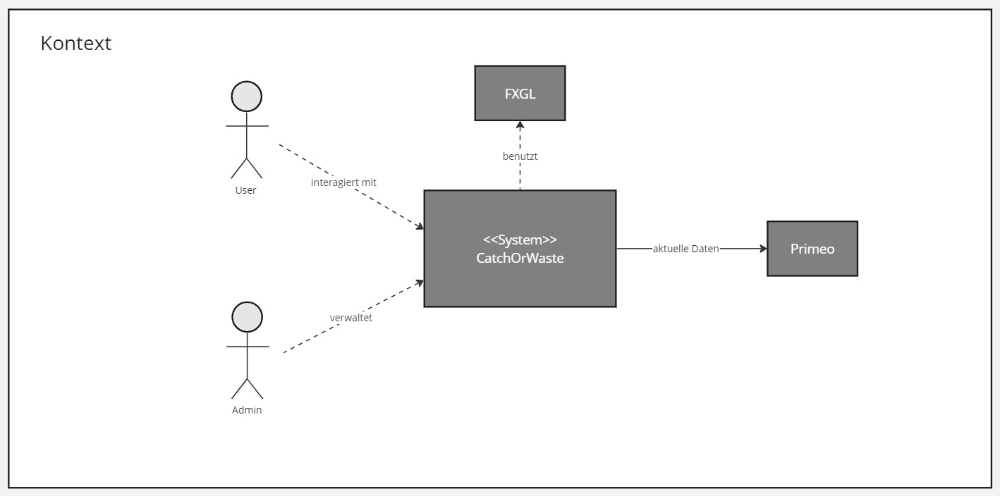
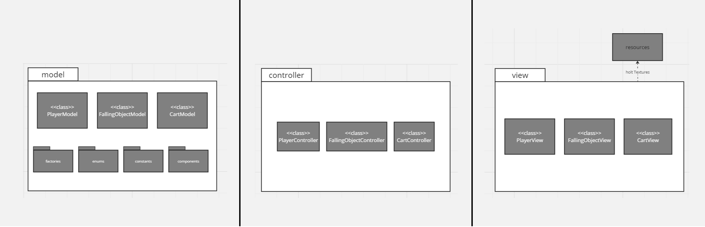

[[section-building-block-view]]
== Bausteinsicht

[role="arc42help"]
****
.Inhalt
Die Bausteinsicht zeigt die statische Zerlegung des Systems in Bausteine (Module, Komponenten, Subsysteme, Klassen, Schnittstellen, Pakete, Bibliotheken, Frameworks, Schichten, Partitionen, Tiers, Funktionen, Makros, Operationen, Datenstrukturen, ...) sowie deren Abhängigkeiten (Beziehungen, Assoziationen, ...)

Diese Sicht sollte in jeder Architekturdokumentation vorhanden sein.
In der Analogie zum Hausbau bildet die Bausteinsicht den _Grundrissplan_.

.Motivation
Behalten Sie den Überblick über den Quellcode, indem Sie die statische Struktur des Systems durch Abstraktion verständlich machen.

Damit ermöglichen Sie Kommunikation auf abstrakterer Ebene, ohne zu viele Implementierungsdetails offenlegen zu müssen.

//.Form
//Die Bausteinsicht ist eine hierarchische Sammlung von Blackboxen und Whiteboxen (siehe Abbildung unten) und deren Beschreibungen.

.Bausteinsicht
Die nachfolgende Bausteinsicht zeigt die Struktur des Systems auf und gibt einen Überblick über die Relationen unter den einzelnen Bausteinen. +
{empty} +
*Diese Bausteinsicht befindet sich noch in Arbeit*

//image::05_building_blocks-DE.png["Hierarchie in der Bausteinsicht"]

{empty} +
   
*Ebene 1* ist die Whitebox-Beschreibung des Gesamtsystems, zusammen mit Blackbox-Beschreibungen der darin enthaltenen Bausteine.

{empty} +

*Ebene 2* zoomt in einige Bausteine der Ebene 1 hinein.
Sie enthält somit die Whitebox-Beschreibungen ausgewählter Bausteine der Ebene 1, jeweils zusammen mit Blackbox-Beschreibungen darin enthaltener Bausteine.

image::../../software(sad)/images/05-Layer_1.jpg[Layer1]

{empty} +

*Ebene 3* zoomt in einige Bausteine der Ebene 2 hinein, usw.

{empty} +

//.Weiterführende Informationen

//Siehe https://docs.arc42.org/section-5/[Bausteinsicht] //in der online-Dokumentation (auf Englisch!).
****

=== Whitebox Gesamtsystem

[role="arc42help"]
****
An dieser Stelle beschreiben Sie die Zerlegung des Gesamtsystems anhand des nachfolgenden Whitebox-Templates.
Dieses enthält:

* Ein Übersichtsdiagramm
* die Begründung dieser Zerlegung
* Blackbox-Beschreibungen der hier enthaltenen Bausteine.
Dafür haben Sie verschiedene Optionen:

** in _einer_ Tabelle, gibt einen kurzen und pragmatischen Überblick über die enthaltenen Bausteine sowie deren Schnittstellen.
** als Liste von Blackbox-Beschreibungen der Bausteine, gemäß dem Blackbox-Template (siehe unten).
Diese Liste können Sie, je nach Werkzeug, etwa in Form von Unterkapiteln (Text), Unter-Seiten (Wiki) oder geschachtelten Elementen (Modellierungswerkzeug) darstellen.

* (optional:) wichtige Schnittstellen, die nicht bereits im Blackbox-Template eines der Bausteine erläutert werden, aber für das Verständnis der Whitebox von zentraler Bedeutung sind.
Aufgrund der vielfältigen Möglichkeiten oder Ausprägungen von Schnittstellen geben wir hierzu kein weiteres Template vor.
Im schlimmsten Fall müssen Sie Syntax, Semantik, Protokolle, Fehlerverhalten, Restriktionen, Versionen, Qualitätseigenschaften, notwendige Kompatibilitäten und vieles mehr spezifizieren oder beschreiben.
Im besten Fall kommen Sie mit Beispielen oder einfachen Signaturen zurecht.
****

****
_<Übersichtsdiagramm>_
****

Begründung:: Das Gesamtsystem wurde nach dem Prinzip des MVC (Model, View, Controller) zerlegt. Diese Zerlegung ermöglicht eine klare Aufteilung der Verantwortlichkeiten der einzelnen Klassen und Methoden. Somit ist es Entwicklern möglich die Komponenten unabhängig von einander zu entwickeln. Ausserdem erleichtert es die Lesbarkeit des Codes da die Klassen kürzer und übersichtlicher gestaltet sind. Es kann sich auf einen spezifischen Teil des Codes konzentriert werden.
Einen weiteren Pluspunkt bietet MVC für das Testing des Codes. Dabei ist erneut die Unabhängigkeit der einzelnen Komponenten von Vorteil.

Enthaltene Bausteine:: 

[cols="1,2" options="header"]
|===
| **Name** | **Verantwortung**
| Benutzer | Liefert Input durch Eingaben (Joystick/Buttons) 
| Admin | Wartet und verbessert das Game 
| CatchOrWaste | Bereitstellen der Applikation 
| FXGL | Bereitstellung der Game-Library 
| Primeo | Bereistellung aktueller Daten zur Ökobilanz von Produkten

|===

Hier folgen jetzt Erläuterungen zu Blackboxen der Ebene 1.

[cols="1,2,3" options="header"]
|===
| **Name** | **Verantwortung** | **Beschreibung**
| CatchOrWaste | Bereitstellen der Applikation | Das System CatchOrWaste stellt mithilfe der Library von FXGL sowie den Daten von Primeo ein unterhaltsames und lehrreiches Arcade-Game zur Verfügung. Es interagiert dabei auf die Eingaben der Benutzer und verhält sich dem entsprechend.
| FXGL | Bereitstellung der Game-Library | FXGL stellt dem System Funktionen und Klassen zur Erstellung und modifizierung von Gameobjekten zur Verfügung. Es bietet eine Grundlage zur Entwicklung des Spiels.
| Primeo | Bereistellung aktueller Daten zur Ökobilanz von Produkten | Primeo versorgt das System mit aktuellen Daten zur Energiekosten der Produktion der Produkte. Dadurch wird es dem System ermöglicht einen Bezug zur Realität herzustellen.
|===

=== Ebene 2

==== Whitebox _CatchOrWaste_

Übersichtsdiagramm::

****
_<Übersichtsdiagramm>_
****

Begründung:: Das Gesamtsystem wurde nach dem Prinzip des MVC (Model, View, Controller) zerlegt. Diese Zerlegung ermöglicht eine klare Aufteilung der Verantwortlichkeiten der einzelnen Klassen und Methoden. Somit ist es Entwicklern möglich die Komponenten unabhängig von einander zu entwickeln. Ausserdem erleichtert es die Lesbarkeit des Codes da die Klassen kürzer und übersichtlicher gestaltet sind. Es kann sich auf einen spezifischen Teil des Codes konzentriert werden.
Einen weiteren Pluspunkt bietet MVC für das Testing des Codes. Dabei ist erneut die Unabhängigkeit der einzelnen Komponenten von Vorteil.

Enthaltene Bausteine:: 

[cols="1,2" options="header"]
|===
| **Name** | **Verantwortung**
| _<Name1>_ | _<Verantwortung1>_
| _<Name2>_ | _<Verantwortung2>_
| _<Name3>_ | _<Verantwortung3>_

|===

Hier folgen jetzt Erläuterungen zu Blackboxen der Ebene 2.

[cols="1,2,1" options="header"]
|===
| **Name** | **Verantwortung** | **Beschreibung**
| _<Name1>_ | _<Verantwortung1>_ | _<Beschreibung1>_
| _<Name2>_ | _<Verantwortung2>_ | _<Beschreibung2>_
| _<Name3>_ | _<Verantwortung3>_ | _<Beschreibung3>_
|===

==== Whitebox _<Baustein 2>_

_<Whitebox-Template>_

...

==== Whitebox _<Baustein m>_

_<Whitebox-Template>_

=== Ebene 3

[role="arc42help"]
****
Beschreiben Sie den inneren Aufbau (einiger) Bausteine aus Ebene 2 als Whitebox.

Bei tieferen Gliederungen der Architektur kopieren Sie diesen Teil von arc42 für die weiteren Ebenen.
****

==== Whitebox <_Baustein x.1_>

[role="arc42help"]
****
...zeigt das Innenleben von _Baustein x.1_.
****

_<Whitebox-Template>_

==== Whitebox <_Baustein x.2_>

_<Whitebox-Template>_

==== Whitebox <_Baustein y.1_>

_<Whitebox-Template>_
