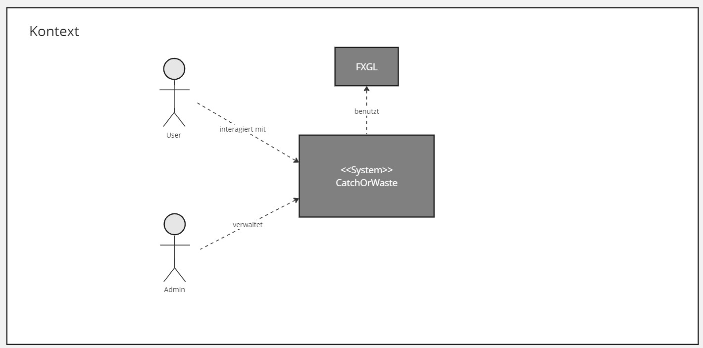
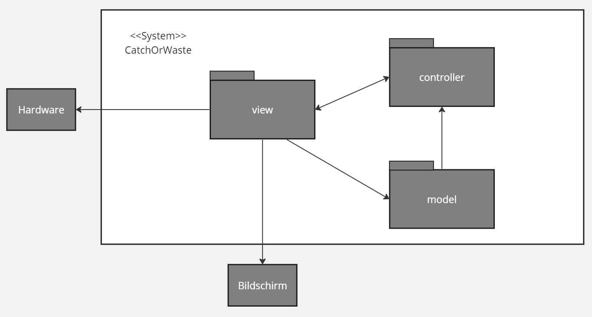
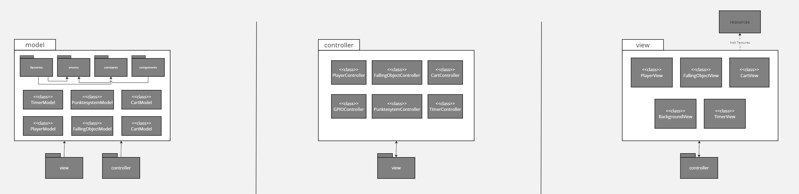
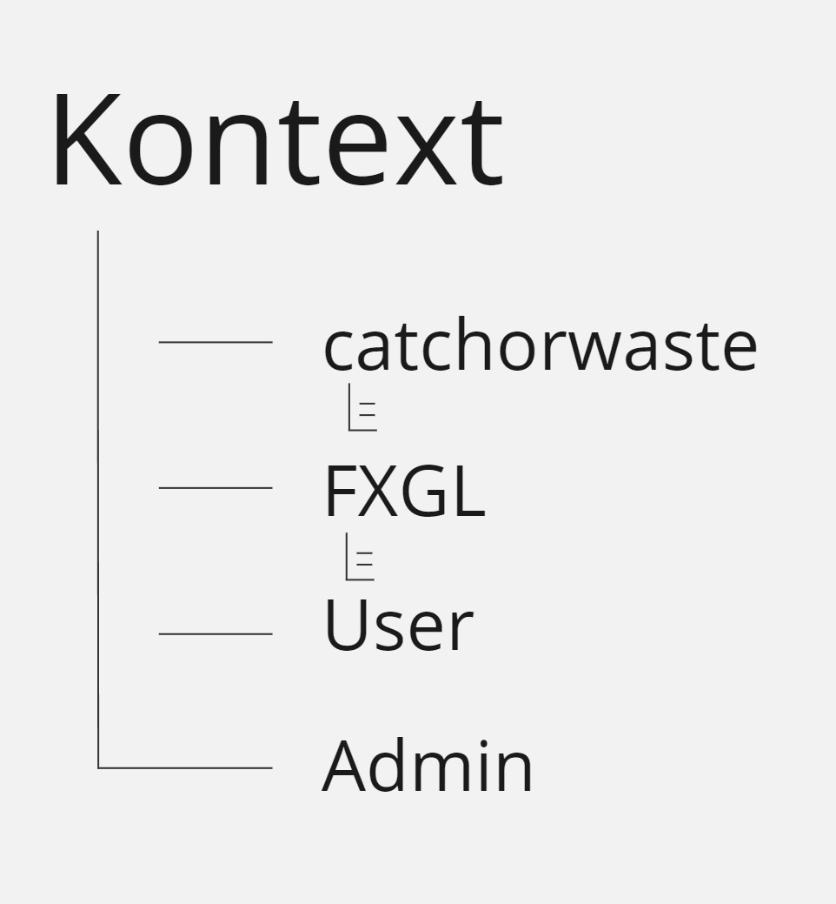
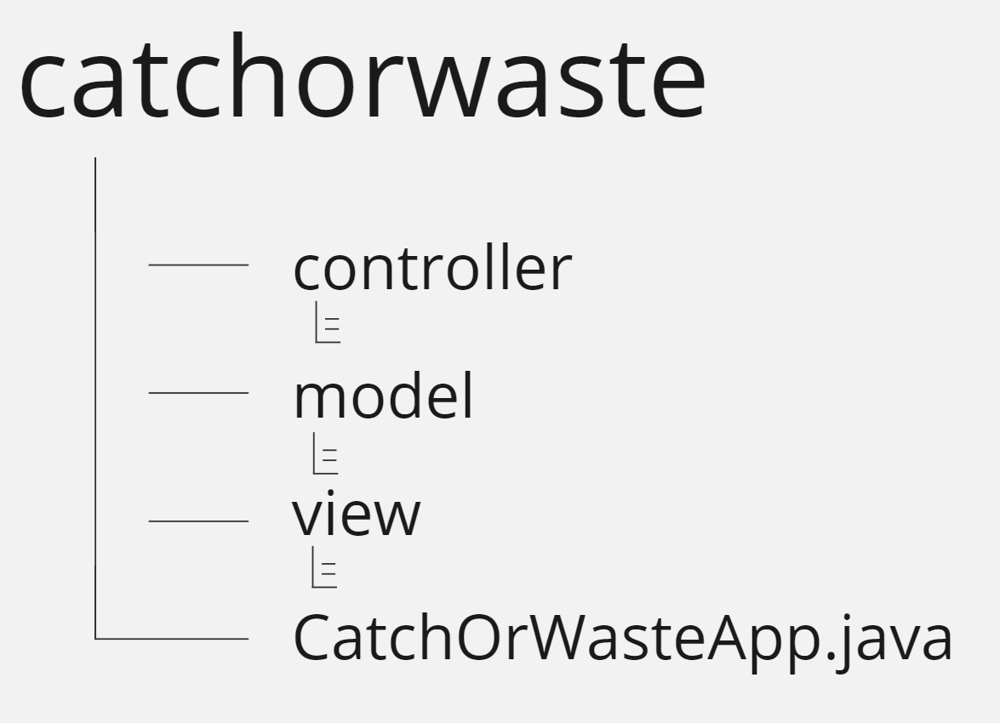
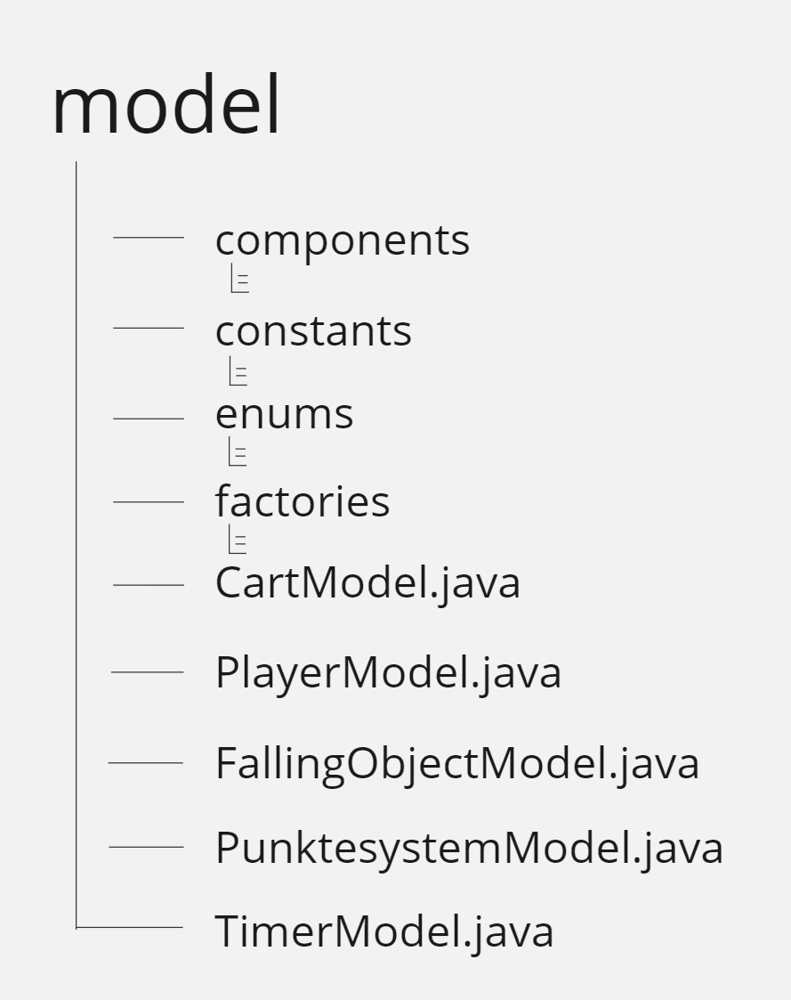
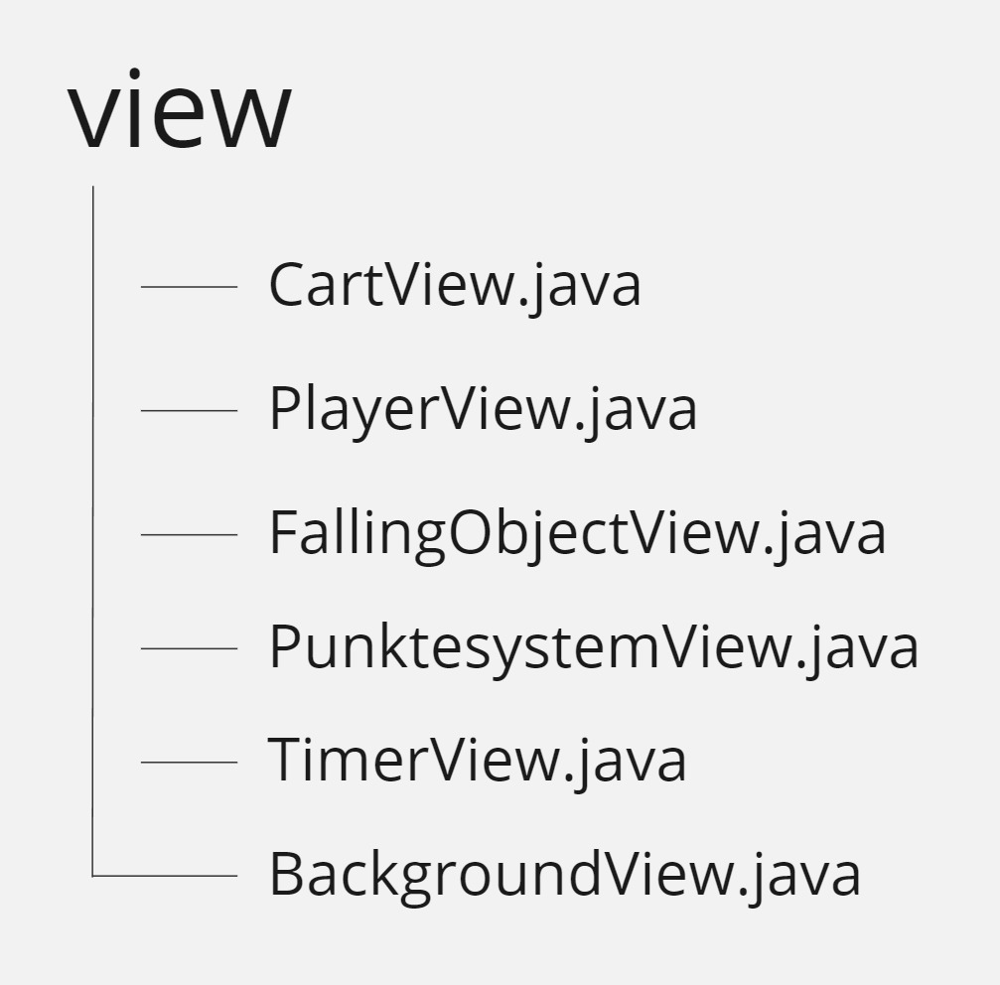
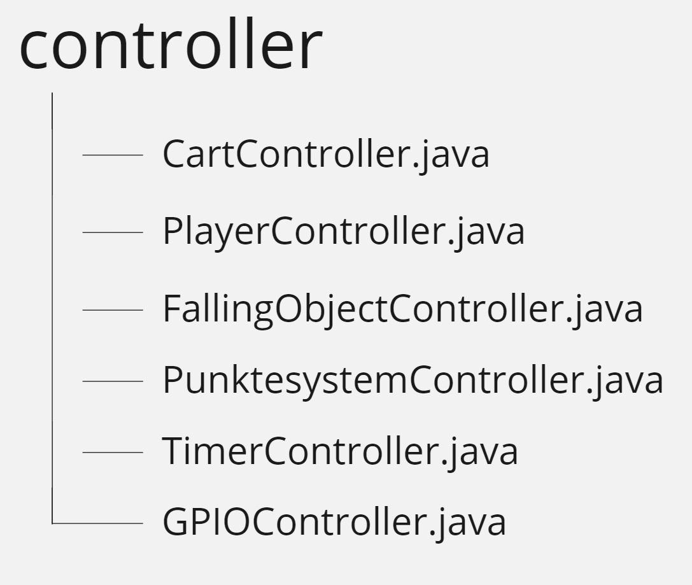

[[section-building-block-view]]
== Bausteinsicht

[role="arc42help"]
****
.Inhalt
Die Bausteinsicht zeigt die statische Zerlegung des Systems in Bausteine (Module, Komponenten, Subsysteme, Klassen, Schnittstellen, Pakete, Bibliotheken, Frameworks, Schichten, Partitionen, Tiers, Funktionen, Makros, Operationen, Datenstrukturen, ...) sowie deren Abhängigkeiten (Beziehungen, Assoziationen, ...)

Diese Sicht sollte in jeder Architekturdokumentation vorhanden sein.
In der Analogie zum Hausbau bildet die Bausteinsicht den _Grundrissplan_.

.Motivation
Behalten Sie den Überblick über den Quellcode, indem Sie die statische Struktur des Systems durch Abstraktion verständlich machen.

Damit ermöglichen Sie Kommunikation auf abstrakterer Ebene, ohne zu viele Implementierungsdetails offenlegen zu müssen.

//.Form
//Die Bausteinsicht ist eine hierarchische Sammlung von Blackboxen und Whiteboxen (siehe Abbildung unten) und deren Beschreibungen.

.Bausteinsicht
Die nachfolgende Bausteinsicht zeigt die Struktur des Systems auf und gibt einen Überblick über die Relationen unter den einzelnen Bausteinen. +
{empty} +
*Diese Bausteinsicht befindet sich noch in Arbeit*

{empty} +
   
*Ebene 1* ist die Whitebox-Beschreibung des Gesamtsystems, zusammen mit Blackbox-Beschreibungen der darin enthaltenen Bausteine.

{empty} +

*Ebene 2* zoomt in einige Bausteine der Ebene 1 hinein.
Sie enthält somit die Whitebox-Beschreibungen ausgewählter Bausteine der Ebene 1, jeweils zusammen mit Blackbox-Beschreibungen darin enthaltener Bausteine.

{empty} +

*Ebene 3* zoomt in einige Bausteine der Ebene 2 hinein, usw.

{empty} +

//.Weiterführende Informationen

//Siehe https://docs.arc42.org/section-5/[Bausteinsicht] //in der online-Dokumentation (auf Englisch!).
****

=== Whitebox Gesamtsystem

[role="arc42help"]
****
An dieser Stelle beschreiben Sie die Zerlegung des Gesamtsystems anhand des nachfolgenden Whitebox-Templates.
Dieses enthält:

* Ein Übersichtsdiagramm
* die Begründung dieser Zerlegung
* Blackbox-Beschreibungen der hier enthaltenen Bausteine.

*Übersichtsdiagramm*

Begründung:: Das Gesamtsystem wurde in das System CatchOrWaste, welches die eigentliche Game-Applikation enthält, sowie die umgebenden Systeme mit denen das Game interagiert unterteilt. Die Game-Applikation stützt sich auf die Library FXGL und bekommt von dort Vorlagen für die Struktur der Applikation sowie die verschiedenen Spielelemente. 
Der Benutzer liefert Eingaben welche vom System CatchOrWaste mithilfe der FXGL-Gamelibrary (grösstenteils) in Visuelle Outputs umgesetzt werden. Dem Admin ist es möglich das System CatchOrWaste bei Bedarf zu reparieren oder zu modifizieren. 

Enthaltene Bausteine:: 

[cols="1,2" options="header"]
|===
| **Name** | **Verantwortung**
| Benutzer | Liefert Input durch Eingaben (Joystick/Buttons) 
| Admin | Wartet und verbessert das Game 
| CatchOrWaste | Bereitstellen der Applikation 
| FXGL | Bereitstellung der Game-Library 

|===

Blackboxen::

[cols="1,2,3" options="header"]
|===
| **Name** | **Verantwortung** | **Beschreibung**
| CatchOrWaste | Bereitstellen der Applikation | Das System CatchOrWaste stellt mithilfe der Library von FXGL  ein unterhaltsames und lehrreiches Arcade-Game zur Verfügung. Es interagiert dabei auf die Eingaben der Benutzer und verhält sich entsprechend.
| FXGL | Bereitstellung der Game-Library | FXGL stellt dem System Funktionen und Klassen zur Erstellung und modifizierung von Gameobjekten zur Verfügung. Es bietet eine Grundlage zur Entwicklung des Spiels.
|===

****

=== Ebene 2

Nachfolgend wird der Baustein "catchorwaste" als Whitebox mithilfe des Whitebox-Templates beschrieben.

==== Whitebox _catchorwaste_
****

*Übersichtsdiagramm*

Begründung:: Das Gesamtsystem wurde nach dem Prinzip des MVC (Model, View, Controller) zerlegt. Diese Zerlegung ermöglicht eine klare Aufteilung der Verantwortlichkeiten der einzelnen Klassen und Methoden. Somit ist es Entwicklern möglich die Komponenten unabhängig von einander zu entwickeln. Ausserdem erleichtert es die Lesbarkeit des Codes, da die Klassen kürzer und übersichtlicher gestaltet sind. Es kann sich auf einen spezifischen Teil des Codes konzentriert werden.
Einen weiteren Pluspunkt bietet MVC für das Testing des Codes. Dabei ist erneut die Unabhängigkeit der einzelnen Komponenten von Vorteil.

Enthaltene Bausteine:: 

[cols="1,2" options="header"]
|===
| **Name** | **Verantwortung**
| Hardware | Physische Entgegennahme von Userinputs
| Bildschirm | Visuelle Darstellung der View
| model | Speicherung und Verwaltung von Daten, Definition von Datenstrukturen
| view | Handling von Userinput, Darstellung der Daten
| controller | Modifizierung und Implementierung der Gamelogik

|===

Erläuterung::

[cols="1,2,1" options="header"]
|===
| **Name** | **Verantwortung** | **Beschreibung**
| model | Speicherung und Verwaltung von Daten, Definition von Datenstrukturen | Das Model speichert und verwaltet Daten wie zum Beispiel die Positionen von Gameobjekten. Des weiteren enthält es weitere Daten, wie zum Beispiel Konstanten der Backgrounds, sowie dazu passsende Schnittstellen. Diese benötigt der Controller um die Gamelogik richtig umzusetzen.
| view | Handling von Userinput, Darstellung der Daten | Die View kümmert sich um das Handling der Userinputs welche von der Hardware kommen und gibt diese nach Bedarf weiter. Ausserdem stellt sie mithilfe der Daten aus dem Model entsprechende Visuelle Komponenten dar und gibt diese zur Ausgabe an den Bildschirm weiter.
| controller | Modifizierung und Implementierung der Gamelogik | Der Controller ist für die Umsetzung der Gamelogik zuständig. Dafür reagiert er auf Inputs des Users (welche nicht in der View bearbeitet werden können) und modifiziert darauf basierend die Daten der Models.
|===
****

=== Ebene 3

[role="arc42help"]

==== Whitebox _model_
****

*Übersichtsdiagramm*

Begründung:: Das model Package enthält die models für verschiedene Entities. Nach dem Prinzip des MVC werden hier Daten gespeichert und verwaltet. Zur besseren Lesbarkeit gibt es weitere Subpackages welche generelle Modelle enthalten. 

Enthaltene Bausteine:: 
[cols="1,2" options="header"]
|===
| **Name** | **Verantwortung**
| components | Speichert components Klassen
| constants | Speichert Constant-Klasse
| enums | speichert Enum-Klasse
| factories | Speichert factory Klassen
| CartModel | Speichert und verwaltet Cart-spezifische Daten
| PlayerModel | Speichert und verwaltet Player-spezifische Daten
| FallingObjectModel | Speichert und verwaltet FallingObject-spezifische Daten
| PunktesystemModel | Speichert und verwaltet Daten zum Punktesystem
| TimerModel | Speichert und verwaltet Daten zum Timer

|===

Erläuterung der Bausteine::
[cols="1,2,1" options="header"]
|===
| components | Speichert components Klassen | Speichert component Klassen. Components werden gebraucht um schon intitialisierten Entities weitere Attribute oder Verhaltensweisen anzuhängen.
| constants | Speichert Constant-Klasse | Speichert eine Java-Klasse welche Konstanten enthält
| enums | speichert Enum-Klasse | Speichert eine Java-Klasse, welche Enums enthält. Enums werden benutzt um Entities einen Typ zuzuweisen.
| factories | Speichert factory Klassen | Speichert eine FXGL-Factory. Diese enthält Blaupausen zur Initialisierung von Entities.
| CartModel | Speichert und verwaltet Cart-spezifische Daten | Dient zur Verwaltung von Daten welche Entities vom Typ Cart betreffen.
| PlayerModel | Speichert und verwaltet Player-spezifische Daten | Dient zur Verwaltung von Daten welche die Entity vom Typ Player betreffen.
| FallingObjectModel | Speichert und verwaltet FallingObject-spezifische Daten | Dient zur Verwaltung von Daten welche Entities vom Typ FallingObject betreffen.
| PunktesystemModel | Speichert und verwaltet Daten zum Punktesystem | Verwaltet Daten zum Punktesystem wie zum Beispiel den aktuellen Punktestand.
| TimerModel | Speichert und verwaltet Daten zum Timer | Verwaltet Daten zum zeitlichen Begrenzung der Spielzeit. 
|===

****

[role="arc42help"]
==== Whitebox _view_
****

*Übersichtsdiagramm*

Begründung:: Die View enthält Klassen für die wichtigsten drei Entities (Cart, Player, FallingObject) sowie für weitere Daten welche Visuell dargestellt werden müssen wie zum Beispiel die verbleibende Zeit oder den aktuellen Punktestand. Die Aufteilung folgt den Klassen des Models, was für eine gute Lesbarkeit und eine klare Struktur über das gesamte Projekt sorgt.

Enthaltene Bausteine::
[cols="1,2" options="header"]
|===
| **Name** | **Verantwortung**
| CartView | Darstellung Cart-spezifischer Daten
| PlayerView | Darstellung Player-spezifischer Daten
| FallingObjectView | Darstellung FallingObject-spezifischer Daten
| BackgroundView | Darstellung des Hintergrundes
| PunktesystemView | Darstellung des aktuellen Punktestandes
| TimerView | Darstellung des Timers

|=== 

Erläuterung der Bausteine::
[cols="1,2,1" options="header"]
|===
| **Name** | **Verantwortung** | **Beschreibung**
| CartView | Darstellung Cart-spezifischer Daten | Die CartView stellt die Entities des Typ Cart nach den Daten des CartModel dar.
| PlayerView | Darstellung Player-spezifischer Daten | Die PlayerView stellt die Entity des Typ Player nach den Daten des PlayerModel dar.
| FallingObjectView | Darstellung FallingObject-spezifischer Daten | Die FallingObjectView stellt die Entities des Typ FallingObject nach den Daten des FallingObjectModel dar.
| BackgroundView | Darstellung des Hintergrundes | Die BackgroundView stellt den Hintergrund dar.
| PunktesystemView | Darstellung des aktuellen Punktestandes | Die PunktesystemView stellt den aktuellen Punktestand nach den Daten aus dem PunktesystemModel dar.
| TimerView | Darstellung des Timers | Die TimerView liest die Daten aus dem TimerModel und stellt diese entsprechend für den Nutzer lesbar dar.
|===
****

[role="arc42help"]
==== Whitebox _controller_
****

*Übersichtsdiagramm*

Begründung:: Der Controller enthält die Logik des Systems. Er folgt weiterhin der Aufteilung nach den drei wichtigsten Entity-Typen. Für Logik welche mehrere Entity-Typen betrifft ist in separaten Klassen gespeichert. Ein Beispiel dafür ist das Punktesystem.

Enthaltene Bausteine:: 
[cols="1,2" options="header"]
|===
| **Name** | **Verantwortung**
| CartController | Implementierung der Logik für Cart-Entities
| PlayerController | Implementierung der Logik für den Player
| FallingObjectController | Implementierung der Logik für FallingObject-Entities
| PunktesystemController | Implementierung der Logik für das Punktesystem
| TimerController | Implementierung der Logik für den Timer
| GPIOController | Implementierung der Logik für Inputhandling.

|===

Erläuterung der Bausteine::
[cols="1,2,1" options="header"]
|===
| **Name** | **Verantwortung** | **Beschreibung**
| CartController | Implementierung der Logik für Cart-Entities | Der CartController sorgt dafür, dass sich Cart-Entities entsprechend der definierten Logik für Carts verhalten.
| PlayerController | Implementierung der Logik für den Player| Der PlayerController sorgt dafür, dass sich die Player-Entity entsprechend der definierten Logik für den Player verhält.
| FallingObjectController | Implementierung der Logik für FallingObject-Entities | Der FallingObjectController sorgt dafür, dass sich FallingObject-Entities entsprechend der definierten Logik für FallingObjects verhalten.
| PunktesystemController | Implementierung der Logik für das Punktesystem | Der PunktesystemController sorgt dafür das je nach Sortierung der FallingObjects entsprechende Punkte gutgeschrieben bzw. abgezogen werden.
| TimerController | Implementierung der Logik für den Timer | Der TimerController sorgt dafür, dass das Spiel nur innerhalb des festgelegten Zeitraums spielbar ist.
| GPIOController | Implementierung der Logik für Inputhandling. | Der GPIOController implementiert die Logik um Benutzerinput von den GPIO-Pins des Raspberry Pi in verständliche Daten für die Software umzuwandeln.
|===
****