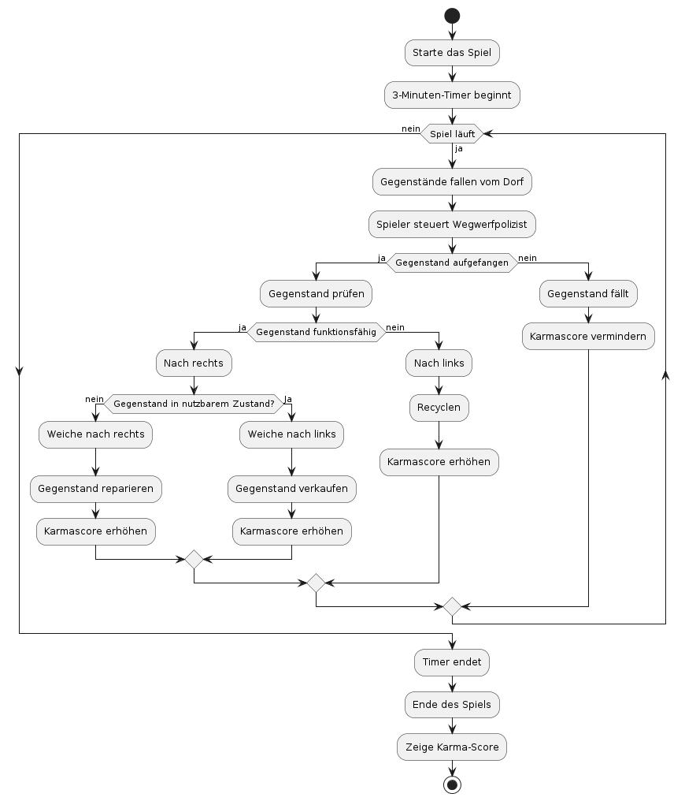
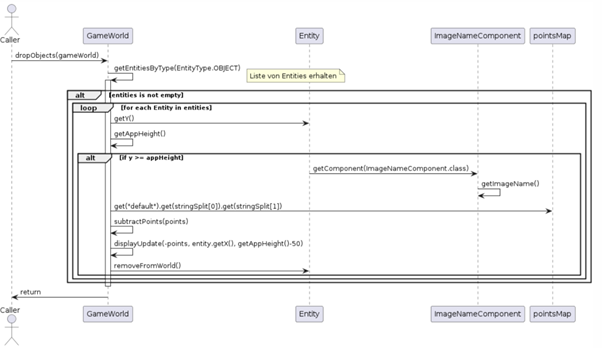
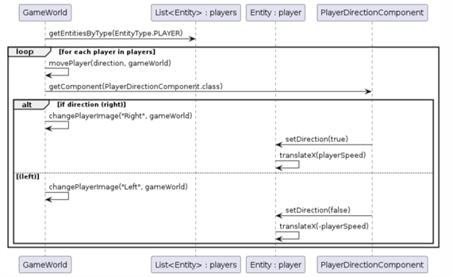

[[section-runtime-view]]
== Laufzeitsicht

[role="arc42help"]

=== Überblick

1. Spielstart
    * Das Spiel beginnt mit der Initialisierung und dem Start eines 3-Minuten-Timers, der das Ende des Spiels markiert.
2. Spielzyklus
    * Während das Spiel läuft, fallen Gegenstände kontinuierlich vom Dorf. Der Spieler steuert den Wegwerfpolizisten, um diese Gegenstände aufzufangen.
3. Entscheidungsprozesse nach dem Auffangen
    * Gegenstand prüfen: Sobald ein Gegenstand aufgefangen wird, überprüft der Spieler, ob der Gegenstand funktionsfähig ist.
    ** Funktionsfähig: Gegenstand wird auf die rechte Schiene gebracht.
    *** Nutzbarem Zustand: Weiche wird nach Links geschaltet und in den Markt gebracht. Der Karmascore erhöht sich.
    *** Nicht nutzbarem Zustand: Weiche wird nach rechts gestellt und repariert. Karmascore erhöht sich.
    ** Nicht Funktionsfähig: Gegenstand wird auf die linke Schiene gebracht und wird recycled. Karmascore erhöht sich.

4. Nicht aufgefangene Gegenstände
    * Wenn Gegenstände nicht aufgefangen werden, fallen sie zu Boden, was zu einer Verringerung des Karma-Scores führt.
5. Spielende
    * Nach Ablauf des Timers endet das Spiel, und der Endscreen mit dem Karma-Score wird angezeigt.

=== Fallende Objekte

* Hier werden Objekte der Spielwelt, die durch GameWorld.getEntitiesByType(EntityType.OBJECT) abgerufen werden, hinsichtlich ihrer Position und Darstellung überprüft. Jedes Objekt, dessen Y-Position die Anwendungshöhe erreicht oder übersteigt, wird einer Punkteberechnung unterzogen, die auf dem Namen der Bilddatei basiert. Diese Punkte werden dann vom Gesamtscore abgezogen und visuell aktualisiert. Schließlich werden die Objekte, die eine bestimmte Grenze erreicht haben, aus der Spielwelt entfernt.

=== Bewegung Spieler

* In der Methode movePlayer(boolean direction, GameWorld gameWorld) werden Spielerentitäten aus der Spielwelt über gameWorld.getEntitiesByType(EntityType.PLAYER) abgefragt und basierend auf ihrer aktuellen Position und Ausrichtung manipuliert. Jede Spielerentität, die diese Methode durchläuft, wird entweder nach rechts oder links verschoben, je nachdem, ob der Parameter direction wahr oder falsch ist. Die Ausrichtung des Spielerbildes und die Bewegungsrichtung werden entsprechend der Eingabe aktualisiert, wobei changePlayerImage die visuelle Darstellung des Spielers ändert und PlayerDirectionComponent.setDirection die interne Ausrichtung setzt. Die Bewegung wird durch player.translateX realisiert, wobei die Geschwindigkeit positiv oder negativ sein kann, abhängig von der gewählten Richtung. Die Aktionen führen zu einer direkten Veränderung der Position der Spielerentitäten in der Spielwelt.

=== _<Bezeichnung Laufzeitszenario n>_

...
