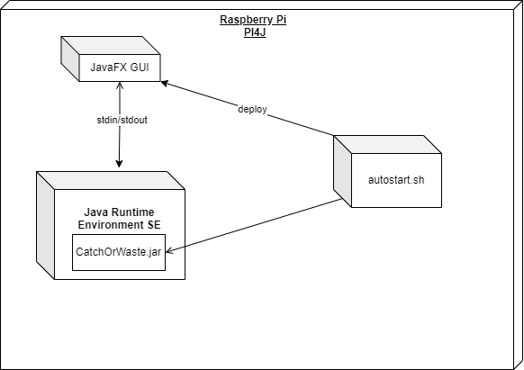

[[section-deployment-view]]
== Verteilungssicht

[role="arc42help"]

=== Infrastruktur Ebene 1

[role="arc42help"]
****
An dieser Stelle beschreiben Sie (als Kombination von Diagrammen mit Tabellen oder Texten):

* die Verteilung des Gesamtsystems auf mehrere Standorte, Umgebungen, Rechner, Prozessoren o. Ä., sowie die physischen Verbindungskanäle zwischen diesen,
* wichtige Begründungen für diese Verteilungsstruktur,
* Qualitäts- und/oder Leistungsmerkmale dieser Infrastruktur,
* Zuordnung von Softwareartefakten zu Bestandteilen der Infrastruktur

Für mehrere Umgebungen oder alternative Deployments kopieren Sie diesen Teil von arc42 für alle wichtigen Umgebungen/Varianten.
****

Begründung:: _<Erläuternder Text>_

Qualitäts- und/oder Leistungsmerkmale:: _<Erläuternder Text>_

Zuordnung von Bausteinen zu Infrastruktur:: _<Beschreibung der Zuordnung>_

=== Infrastruktur Ebene 2

[role="arc42help"]
****
An dieser Stelle können Sie den inneren Aufbau (einiger) Infrastrukturelemente aus Ebene 1 beschreiben.

Für jedes Infrastrukturelement kopieren Sie die Struktur aus Ebene 1.
****

==== _<Infrastrukturelement 1>_

_<Diagramm + Erläuterungen>_

==== _<Infrastrukturelement 2>_

_<Diagramm + Erläuterungen>_

...

==== _<Infrastrukturelement n>_

_<Diagramm + Erläuterungen>_
