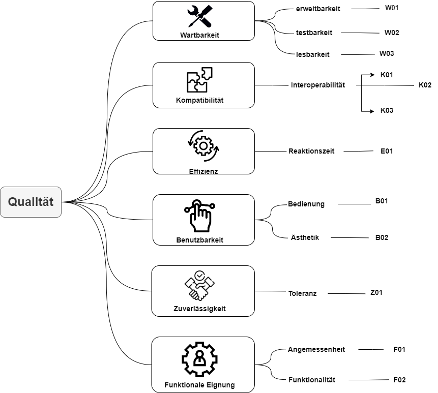

[[section-quality-scenarios]]
== Qualitätsanforderungen

[role="arc42help"]
****
.Inhalt
Dieser Abschnitt enthält möglichst alle Qualitätsanforderungen als Qualitätsbaum mit Szenarien.
Die wichtigsten davon haben Sie bereits in Abschnitt 1.2 (Qualitätsziele) hervorgehoben.

Nehmen Sie hier auch Qualitätsanforderungen geringerer Priorität auf, deren Nichteinhaltung oder -erreichung geringe Risiken birgt.

.Motivation
Weil Qualitätsanforderungen die Architekturentscheidungen oft maßgeblich beeinflussen, sollten Sie die für Ihre Stakeholder relevanten Qualitätsanforderungen kennen, möglichst konkret und operationalisiert.
****

.Weiterführende Informationen

Siehe https://docs.arc42.org/section-10/[Qualitätsanforderungen] in der online-Dokumentation (auf Englisch!).

=== Qualitätsbaum

[role="arc42help"]
****

****

=== Qualitätsszenarien

[role="arc42help"]
****

[options="header"]
|================================================================================================================================================================================================================================================================================================================================================================
| ID  | Punkt             | Szenario | Sicherstellung
| W01 | Erweitbarkeit     | Eine Fachperson mit genügenden Kenntnissen in Java und JavaFx sollte anhand der Ordnerstruktur und den Kommentaren/Verweisen den Aufbau verstehen und nicht funktionale Anpassungen, wie die Übersetzung der Texte im Spiel, sollen nach wenigen Stunden machbar sein. Für grosse Anpassungen reicht eine Woche. | Durch das mitgelieferte ReadMe, SAD und den beinhalteten Verweisen auf den Source-Code kann sich der Leser gut orientieren. Code-Kommentare helfen dem Entwickler zusätzlich, die Software schneller zu verstehen.
| W02 | Testbarkeit       | Allfällige Anpassungen sollen klar und ersichtlich getestet werden können, ohne ein grosses Vorwissen dazu zu besitzen. Der Code ist modular gehalten und kann sich auf Änderungen anpassen, ohne dass die Funktionalität verloren geht. |
| W03 | Lesbarkeit        | Eine Person kann anhand der Dokumentation mit JavaDoc nachvollziehen, wie die Struktur des Codes aufgebaut ist. Die Verständlichkeit ist der Person kein Hinderniss und kann mit den gegebenen Mitteln auskunft über das System geben (White-Box Wissen). | Die Einhaltung von Coding Conventions stellt einen Standard sicher, dass der Source-Code verständlich und nachvollziehbar bleibt. Zusätzlich wird während der Entwicklung Code Reviews durchgeführt, mindestens vor einem Merge eines Feature-Branch.
| K01 | Interoperabilität | Der Spieler benutzt einen Joystick mit Buttons, um Inputs in das Spiel zu übertragen. Die Hardware funktioniert dabei einwandfrei und lässt keine validen Inputs verloren. Nicht definierte Inputs werden nicht aufgenommen. | Es ist eine robuste Input-Verarbeitung implementiert, die ungültige Inputs ohne Leistungsdefizite ignorieren kann.
| K02 | Interoperabilität | Die Arcadehardware kann auf andere Peripheriegeräte reagieren und interpretiert Inputs korrekt wie angegeben. | Der Input-Reader ist dokumentiert und definiert klar, über welchen Kanal welcher Input geleitet wird. Über den USB-Anschlüssen kann extern mittels Tastatur und Maus auf das System oder Spiel zugegriffen werden.
| K03 | Interoperabilität | Ein Problem mit der Verbindung der Hardware kann mithilfe des ReadMe und den Verweisen im Code behoben werden, sofern eine ähnlich aufzubauende Hardware gebraucht wird. | Das Handbuch, im ReadMe, erhilft möglichen Hardwarewechseln mit einer Dokumentation, wie die ursprünglichen Peripheriegeräte gesteuert werden.
| E01 | Reaktionszeit     | Die Person bewegt den Wegwerfpolizisten und bemerkt keine Verzörgerung bei Richtungsänderungen oder bei Aufnahme der Fallenden Objekte. Somit kann der Spielspass gewährleistet werden. | Es werden Echtzeit-Tests durchgeführt unter realistischen Bedingungen. Das bedeutet, das ganze System wird für längere Zeit ausgestellt und läuft kontinuierlich.
| B01 | Bedienung         | Die Steuerung des Spiels erfolgt über einen robusten Joystick und klar reagierende Buttons. Eine kurze Einführungsvorschau beim Start des Spiels erklärt die grundlegenden Spielmechaniken und die Verwendung der Steuerelemente, sodass Spieler unabhängig von ihrem vorherigen Wissen intuitiv starten können. | Mit Usability Tests zum Spielerverhalten beim Start des Spiels kann die grundlegende Spielidee und Bedienung sichergestellt werden.
| B02 | Ästhetik          | Das Spiel präsentiert sich in einem ansprechenden Retro-Stil mit lebendigen Farben und charakteristischen Pixelgrafiken, die speziell auf die Zielgruppe der 13- bis 16-Jährigen abgestimmt sind. Diese visuelle Gestaltung unterstützt das nostalgische Flair und fördert die Immersion in das Spielgeschehen. | Das Retro-Design wird auf sämtlichen Produkten unserer Seite vertreten sein und ist ein einzigartiges Image. Auf Feedback von der Zielgruppe wurden allfällige Änderungen vollzogen.
| Z01 | Toleranz          | Die Software des Arcadekastens ist darauf ausgelegt, Fehleingaben effektiv zu handhaben. Bewegungen des Joysticks nach oben und unten haben keine Auswirkungen im Spiel, wodurch unbeabsichtigte Aktionen vermieden werden. Das System ist stabil konzipiert und gewährleistet, dass auch bei intensiver Nutzung durch viele Spieler keine Leistungseinbußen auftreten.|  Mithilfe von diversen Tests können alle Punkte abgedeckt werden.
| F01 | Angemessenheit    | Das Spiel bietet eine ausgewogene Herausforderung, die weder zu leicht noch zu schwer für die Altersgruppe der 13- bis 15-Jährigen ist. Es kombiniert Elemente, die sowohl das Geschick als auch die Reaktionsfähigkeit fordern, und hält die Spieler mit zunehmend schwierigeren Levels engagiert, während es gleichzeitig Spass macht. | Eine regelmässige Überprüfung im Team für die Schwierigkeit ist nach jedem Start auf der Hardware gedacht. Die Meinung der Zielgruppe wird berücksichtigt und anhand dieser wird die Schwierigkeit angepasst.
| F02 | Funktionalität    | Unabhängig von der Spieldauer lässt das System kontinuierlich Gegenstände herab, die vom Spieler gefangen werden müssen. Diese Mechanik ist zentral für das Gameplay und funktioniert fehlerfrei, um ein durchgängiges und unterbrechungsfreies Spielerlebnis zu gewährleisten. | Durch Tests konnte ein nicht funktionales Eintreten ausgeschlossen werden. Bei allfälligen Probleme kann das System neugestartet werden und das Spiel wird automatisch gestartet.
|================================================================================================================================================================================================================================================================================================================================================================

****
